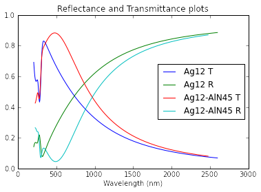
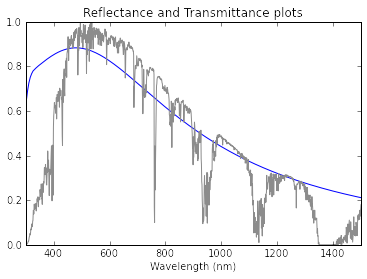
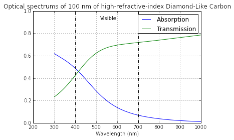
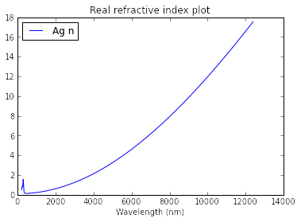
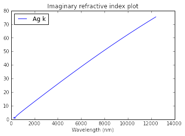
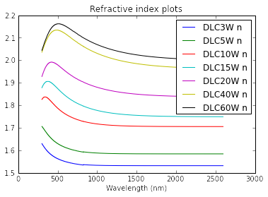
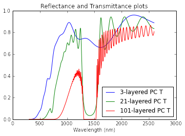
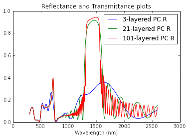

# opt_sim quick start

opt_sim is a library that implements the transfer matrix method to simulate the optical far fields of multilayer thin films. Below are examples of typical usages of the library.

The transfer matrix method characterizes each layer in a multilayer thin film by its thickness and spectral refractive index (nk). We have select materials with their nk values that we use often in the library.


```python
import opt_sim as opt
print opt.nklib.material_list
```

    ['Ag', 'Al', 'AlN', 'BK7', 'DLC3W', 'DLC5W', 'DLC10W', 'DLC15W', 'DLC20W', 'DLC40W',
    'DLC60W', 'DLC80WA', 'ITO', 'PDMS', 'ZnO']
    

Each of the materials is a subclass of the Layer class. The MultiLayer class is the physical model of the multilayer thin film and is composed of a list of Layers and. Let's say we want to look at the transmittance of an ultrathin silver film with and without an aluminum nitride antireflection coating. First we initialize the structures.


```python
from opt_sim.structure import MultiLayer as ML
from opt_sim.nklib import *
Ag12 = Ag(12)  # Thickness is the only required input. Default unit is nanometer.
AlN45 = AlN(45)
AgStruct = ML([Ag12])  # Default environment-substrate configuration is air-glass.
AgAlNStruct = ML([Ag12, AlN45])  # Ordered from substrate to environment.
```

To make the structure configuration clear, a schematic of the structure can be printed in the console.


```python
print AgStruct
print AgAlNStruct
```

    
    Top
    --------
    Ag 12 nm
    --------
    
    
    Top
    ---------
    AlN 45 nm
    ---------
    Ag 12 nm
    ---------
    
    

We can now plot the two structurues' transmittance and reflectance curve.


```python
%matplotlib inline
# Put structures in a list to plot them in the same window.
opt.plot.TR([AgStruct, AgAlNStruct])
```





Some options are given in TR, for example:


```python
opt.plot.TR([AgAlNStruct], curves="T", show_solar=True, legend=False,
            min_wl=300, max_wl=1500)
```





where the background curve is the AM1.5 solar spectrum.

Should we want to manually make our figure using matplotlib.pyplot, the far fields have to be calculated with a call explicitly from the MultiLayer class. In opt.plot.TR this was automatically performed.


```python
import matplotlib.pyplot as plt  # Also accessible from opt.plot.plt

DLC_coat = ML([DLC60W(100)])
DLC_coat.calculate_TR()
# DLC_coat now has initialized attributes .T, .R, and .A representing the far fields.

plt.figure()
plt.title("Optical spectrums of 100 nm of high-refractive-index Diamond-Like Carbon")
plt.plot(DLC_coat.wl, DLC_coat.A, label="Absorption")
plt.plot(DLC_coat.wl, DLC_coat.T, label="Transmission")
plt.xlim(200, 1000)
plt.xlabel("Wavelength (nm)")
plt.legend(loc=0)
plt.grid("on")
plt.plot([400, 400], [0, 1], "k--")
plt.plot([700, 700], [0, 1], "k--")
plt.text(520, 0.92, "Visible")
```


    <matplotlib.text.Text at 0x56d0e10>





This thin film has a nonuniform transmittance across the visible, making it coloured. opt_sim provides RGB calculation of the coating in (255, 255, 255) format.


```python
DLC_coat.calculate_color()
print DLC_coat.T_color
```

    (171, 167, 135)
    

Lastly, the refractive index of individual materials can be produced. Shown below is the real and imaginary component of the refractive index of silver.


```python
opt.plot.nk([Ag12], sep=True)  # Shows n and k in separate windows.
```








For fun, let's look at the optical spectrum of photonic crystals. A photonic crystal is composed of a stack of alternating layers of different refractive indices. This type of structure will create passbands and stopbands in the spectrum. Depending on the number of layers, the bands will look either broad or sharp. An ideal photonic crystal will have a spectrum that looks like a step function.

First, we want to select two materials with different refractive indices. And actually, we can make do with just one material if it has variability in its refractive index. Diamond-Like Carbon is one of them. We can change its refractive index depending on the fabrication parameters.


```python
opt.plot.nk([DLC(1) for DLC in opt.nklib.DLC_list], curves="n")
opt.plot.show()
```





Now we create MultiLayers with alternating DLC's, one where the refractive index is low and one where the refractive index is high. Depending on the number of layers, the spectrum can look drastically different.


```python
DLC_L = DLC3W(200)
DLC_H = DLC60W(200)
PC3 = ML([DLC_L, DLC_H] * 3 + [DLC_L], label="3-layered PC")
PC21 = ML([DLC_L, DLC_H] * 10 + [DLC_L], label="21-layered PC")
PC101 = ML([DLC_L, DLC_H] * 50 + [DLC_L], label="101-layered PC")
opt.plot.TR([PC3, PC21, PC101], curves="T")
opt.plot.TR([PC3, PC21, PC101], curves="R")
opt.plot.show()
```








```python

```
